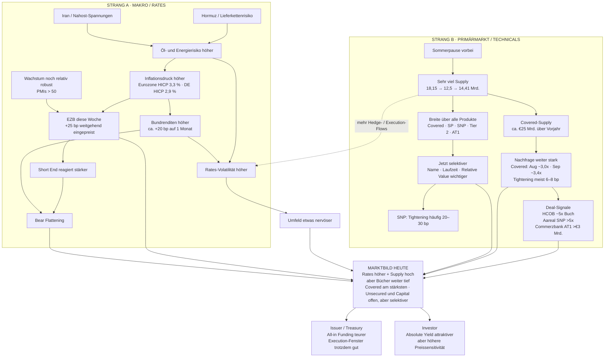

# DCM Market Update – 06.09.2026

**GitHub-Version | ausgewählte Teile aus dem Notion-DCM-Marktupdate vom 6. September 2026**

## 30-Sekunden-Einstieg

- Der EUR-FIG-Primärmarkt ist nach der Sommerpause sehr stark zurückgekommen.
- Drei kräftige Wochen in Folge: rund **€18,15 Mrd.**, **€12,5 Mrd.** und zuletzt **€14,41 Mrd.**.
- Gleichzeitig sind die **Rates deutlich höher**; Bunds lagen auf Monatssicht grob **20 bp höher**.
- Trotzdem bleiben die Bücher stark – besonders bei **Covered Bonds**, aber auch bei Senior und Subordinated.
- Kurz gesagt: **Funding ist all-in teurer geworden, aber der Markt bleibt sehr aufnahmefähig.**

## Big Picture – Kausalkette

## 1. Rates & Makro

- **Bund 2Y:** ca. **2,96 %**, rund **+10 bp zur Vorwoche**.
- **Bund 10Y:** ca. **3,34 %**, rund **+7 bp zur Vorwoche**.
- **Bund 30Y:** ca. **3,82 %**, rund **+5 bp zur Vorwoche**.
- Das ergibt ein **Bear Flattening**: das kurze Ende ist stärker gestiegen als das lange Ende.
- Eurozonen-Inflation im August: **3,3 %**; Deutschland HICP: **2,9 %**.
- Eurozone Manufacturing PMI: **52,7**; Deutschland: **54,3**.
- Für das EZB-Meeting am **10. September** war ein **25-bp-Schritt auf 2,50 %** sehr stark eingepreist.

> **Call-Satz:** „Was sich seit unserem letzten Update am stärksten verändert hat, ist die Rates-Seite. Die Bund-Kurve ist deutlich höher, vor allem am kurzen Ende. Gleichzeitig ist das Primärmarktfenster aber offen geblieben.“

## 2. Primärmarkt – stark, aber selektiver

- Sehr viel Supply seit der Sommerpause.
- Breite Aktivität über **Covered, Senior Preferred, Senior Non-Preferred, Tier 2 und AT1**.
- Covered-Supply liegt ungefähr **€25 Mrd. über Vorjahr**.
- Durchschnittliche Covered-Oversubscription im August fast **3x**, im September bislang etwa **3,4x**.
- Covered-Tightening meist **6–7 bp**, einzelne Deals bis **8 bp**.
- Bei Senior Non-Preferred häufig **20–30 bp IPT-to-Reoffer-Tightening**.
- Die entscheidende Nuance: **Der Markt ist offen, aber nicht mehr blind aggressiv.**
- Investoren schauen bei unsecured FIG stärker auf **Name, Laufzeit, NIP und Relative Value**.

> **Call-Satz:** „Ich würde den Markt nicht einfach nur als stark bezeichnen. Er ist stark, aber selektiver. Gute Namen bekommen sehr tiefe Bücher. Gleichzeitig muss das Relative Value stimmen.“

## 3. Ausgewählte Transaktionen

### Hamburg Commercial Bank – Ship Covered
- **€500 Mio.**, Fälligkeit September 2029.
- Kupon **3,375 %**.
- IPT **MS +33 bp**, final **MS +25 bp**.
- **8 bp Tightening**.
- Finales Buch rund **€2,5 Mrd.** – grob **5x**.

### Aareal Bank – Green Senior Non-Preferred
- **€300 Mio.**, fünf Jahre.
- Orderbuch **über €1,55 Mrd.**.
- Mehr als **5x überzeichnet**.
- Finales Pricing **30 bp tighter** als initiale Guidance.

### Commerzbank – AT1
- **€750 Mio. AT1**, Perpetual NC April 2034.
- Kupon **6,25 %**.
- Orderbuch **über €3 Mrd.**.
- Sehr tightes Pricing – zeigt starken Appetit auf Bankkapital.

## 4. Issuer- und Investor-Lens

### Für Issuer / Treasury
- Basiszins deutlich höher → **All-in Funding teurer**.
- Credit-Bedingungen bleiben jedoch konstruktiv.
- Große Bücher erlauben weiterhin deutliches Tightening.
- Die wichtigere Frage ist weniger „Ist der Markt offen?“ als:
  **„Ist das heutige Fenster attraktiv gegenüber dem Risiko, dass Rates oder Credit später schlechter werden?“**

### Für Investoren
- Höhere absolute Renditen machen Neuemissionen attraktiver.
- Covered bleibt das tiefste Nachfragebecken.
- In Senior und Subordinated wird stärker differenziert.
- Bei zu aggressivem Pricing verschwinden taktische Orders schnell.

## 5. Fünf Standardsätze für Calls

1. **„Rates sind höher, aber der Primärmarkt hat das bisher erstaunlich gut absorbiert.“**
2. **„Wir sehen nicht nur Volumen, sondern Breite über die gesamte Kapitalstruktur.“**
3. **„Covered ist aktuell das tiefste Nachfragebecken, aber auch Senior und Subordinated funktionieren sehr gut.“**
4. **„Die Bücher sind stark, aber Investoren werden beim finalen Pricing selektiver.“**
5. **„Für Issuer ist Funding all-in teurer. Gleichzeitig ist die Execution-Qualität im Credit weiterhin sehr gut.“**

## 6. Gute Anschlussfragen

- **„Wie schaut ihr aktuell auf das höhere Rates-Niveau – eher Grund zu warten oder eher ein Argument, ein gutes Credit-Fenster zu nutzen?“**
- **„Wo seht ihr aktuell den größten Investor-Pull – eher kurze Senior-Laufzeiten oder gibt es auch wieder mehr Nachfrage nach Duration?“**
- **„Wie wichtig ist euch aktuell die absolute Yield gegenüber dem Spread-Level?“**
- **„Verändert das höhere Rates-Niveau euer Timing, Prefunding oder Hedging?“**

## 7. Commerzbank Research – kurzer Read-through

- Commerzbank erwartete am **10. September +25 bp auf 2,50 %**, war für die Zeit danach aber **weniger hawkish als der Markt**.
- Kurzfristig sah Research weiter **Aufwärtsdruck auf Bundrenditen**, vor allem über Energie-/Gaspreise und Nahost-Risiken.
- Im Covered-Markt war das bemerkenswerte Signal: **sehr hohes Supply**, gleichzeitig **leicht engere Sekundärspreads** und teilweise **leicht negative NIPs**.
- DCM-Fazit: **Rates schwieriger, Credit-Technicals konstruktiv.**

## Ein-Satz-Fazit

> **„Das aktuelle EUR-FIG-Bild ist konstruktiv: deutlich höhere Rates, sehr viel Supply, aber weiterhin tiefe Bücher und starke Execution – mit zunehmender Preissensitivität bei unsecured.“**

---

**Quelle:** Notion – *06.09.2026 – DCM Marktupdate* inklusive der Unterseiten *Big Picture – Kausalkette* und *Commerzbank Research – EZB & Covered Bonds*.
