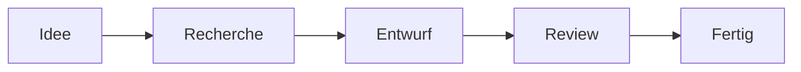
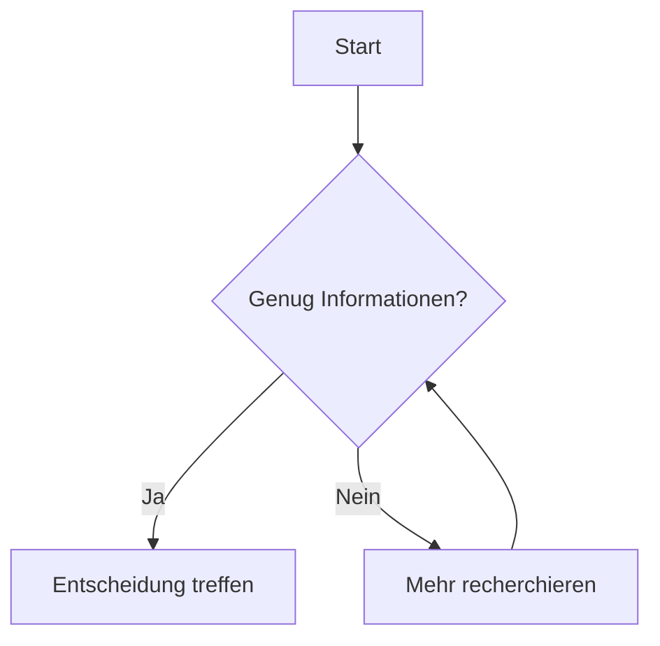
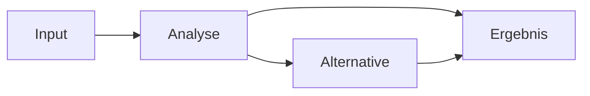
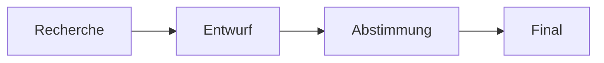

# Markdown Showcase

Eine kleine Spielwiese, die zeigt, was GitHub-Markdown alles darstellen kann.

---

## 1. Überschriften & Text

# Überschrift 1
## Überschrift 2
### Überschrift 3

**Fett**, *kursiv*, ~~durchgestrichen~~ und `Inline-Code`.

Ein normaler Absatz kann natürlich auch einfach Fließtext enthalten.

---

## 2. Hinweise / Callouts

> [!NOTE]
> Das ist ein neutraler Hinweis.

> [!TIP]
> Hier kann ein nützlicher Tipp stehen.

> [!IMPORTANT]
> Das ist besonders wichtig.

> [!WARNING]
> Hier sollte man genauer hinschauen.

> [!CAUTION]
> Das ist ein kritischer Hinweis.

---

## 3. Aufgaben mit Checkboxen

- [x] Idee festhalten
- [x] Struktur erstellen
- [ ] Inhalt ergänzen
- [ ] Review durchführen
- [ ] Fertigstellen

---

## 4. Tabellen

| Thema | Status | Priorität | Fortschritt |
|---|---|---|---:|
| Projekt Alpha | Aktiv | Hoch | 80% |
| Projekt Beta | Planung | Mittel | 35% |
| Projekt Gamma | Wartet | Niedrig | 10% |

---

## 5. Zitate

> Gute Notizen sind weniger ein Archiv als ein externes Gedächtnis.

Verschachtelte Zitate gehen ebenfalls:

> Ebene 1
>> Ebene 2

---

## 6. Aufklappbare Inhalte

<details>
<summary><strong>Details anzeigen</strong></summary>

Hier kann längerer Inhalt versteckt werden, damit die Hauptseite übersichtlich bleibt.

- Zusatzpunkt A
- Zusatzpunkt B
- Zusatzpunkt C

</details>

<details>
<summary>Noch ein Beispiel</summary>

Auch Tabellen funktionieren innerhalb solcher Bereiche:

| Kennzahl | Wert |
|---|---:|
| A | 42 |
| B | 17 |
| C | 91 |

</details>

---

## 7. Formeln

GitHub kann mathematische Formeln darstellen.

Inline:

$PV = \frac{CF}{(1+r)^t}$

Als eigene Formel:

$$
NPV = \sum_{t=1}^{n} \frac{CF_t}{(1+r)^t} - I_0
$$

Und etwas generischer:

$$
x = \frac{-b \pm \sqrt{b^2-4ac}}{2a}
$$

---

## 8. Mermaid-Diagramme

### Einfacher Prozess



### Entscheidung



### Timeline-artige Abhängigkeit



---

## 9. Codeblöcke

### Python

```python
def greet(name):
    return f"Hallo {name}"

print(greet("Welt"))
```

### JSON

```json
{
  "projekt": "Alpha",
  "status": "aktiv",
  "fortschritt": 80
}
```

---

## 10. Listen

### Nummeriert

1. Erstes Thema
2. Zweites Thema
3. Drittes Thema

### Verschachtelt

- Oberpunkt
  - Unterpunkt A
  - Unterpunkt B
    - Noch eine Ebene
- Zweiter Oberpunkt

---

## 11. Links

- [GitHub](https://github.com)
- [Wikipedia](https://www.wikipedia.org)
- [OpenAI](https://www.openai.com)

Du kannst auch direkt innerhalb des Repositories verlinken:

- [Zur Startseite](README.md)
- [Zum Marktupdate](market-update-2026-09-06.md)

---

## 12. Fußnoten

Ein Satz kann eine Zusatzinformation enthalten.[^1]

Noch eine Aussage mit Quelle oder Erklärung.[^2]

[^1]: Das ist eine Fußnote.
[^2]: Fußnoten erscheinen gesammelt am Ende der Seite.

---

## 13. Trennlinien

Oben steht Inhalt.

---

Unten geht ein neuer Abschnitt los.

---

## 14. Mini-Dashboard

> [!IMPORTANT]
> **Status:** Alles läuft planmäßig.

| Bereich | Zustand | Nächste Aktion |
|---|---|---|
| Planung | ✅ Fertig | Umsetzung starten |
| Umsetzung | 🟡 Läuft | Review vorbereiten |
| Review | ⚪ Offen | Termin setzen |

### Heute

- [x] Wichtigstes Thema identifizieren
- [ ] Zwei offene Punkte klären
- [ ] Ergebnis dokumentieren

### Kurzfazit

**Kerngedanke:** GitHub kann Markdown so rendern, dass eine einfache Textdatei fast wie eine kleine Wissensseite oder ein Dashboard wirkt.

---

## 15. Kombination mehrerer Elemente

> [!TIP]
> Besonders gut wirkt GitHub-Markdown, wenn man nicht alles gleichzeitig benutzt, sondern pro Seite nur wenige Elemente gezielt kombiniert.

<details>
<summary><strong>Beispiel für einen kompakten Projektstatus</strong></summary>

### Projekt Orion

**Status:** 🟡 In Bearbeitung

| Punkt | Stand |
|---|---|
| Recherche | ✅ |
| Entwurf | ✅ |
| Abstimmung | 🟡 |
| Abschluss | ⚪ |

**Nächster Schritt:** Offene Fragen klären.



</details>
